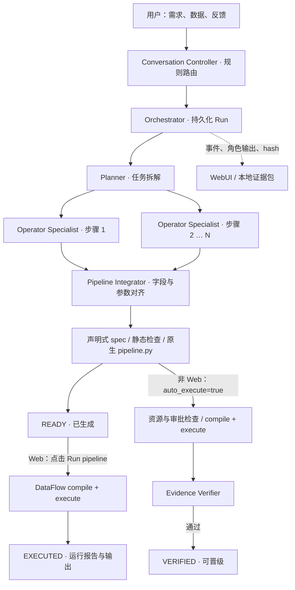

<div align="center">

# DataFlow Multi-Agent System

**用自然语言编排 DataFlow Pipeline，让生成过程、算子来源和执行证据可追溯。**


[](pyproject.toml)
[](https://github.com/OpenDCAI/DataFlow)
[](frontend/package.json)
[](#当前范围与限制)

[快速开始](#快速开始) · [协作架构](#协作架构) · [Agent 与 Skills](#agent-与-skills) · [运行证据](#运行证据与展示) · [配置与 API](docs/workbench-reference.md)

</div>

---

DataFlow-MultiAgent 采用多 Agent 协作架构，将自然语言数据处理需求转换为可由 DataFlow 编译和执行的 Pipeline。

DataFlow-MultiAgent 基于 OpenDCAI 全自研的 [DataFlow](https://github.com/OpenDCAI/DataFlow)（8.2k stars）和 [DataFlow Harness](https://github.com/OpenDCAI/DataFlow-WebUI)（240 stars）构建，在已有数据处理能力之上引入多 Agent 协作，让自然语言需求到可执行数据流水线的转化更易用、更透明、更可追溯。

为便于用户掌握协作进度、审阅产物并追溯问题，前端提供统一对话入口、Agent 活动、Skill 调用记录、Pipeline / Operator 完整源码预览和逐阶段输出。每次任务运行（Run）保留输入快照、角色输出、事件和版本信息，便于调试与复核。此外，架构设计上还明确区分不同完成程度，避免将代码生成等同于任务完成：

> **生成、执行、验证是三个不同的结果。** 默认 Web 流程生成到 `READY`；点击 **Run pipeline** 后实际执行，成功为 `EXECUTED`。只有独立 Verifier 通过的流程才是 `VERIFIED`。

## 核心能力

| 能力 | 当前实现 |
| --- | --- |
| 多角色协作 | Codex 模式下，每次角色调用启动独立 `codex exec` 进程；Specialist 按步骤并行，Integrator 等待汇合 |
| 基于源码的算子选择 | AST 提取 DataFlow 注册算子、参数签名与源码 hash，优先复用已有算子 |
| 生成与运行分离 | 先静态检查 spec，再由用户显式启动 DataFlow 编译与执行 |
| 原生风格代码 | 生成的 `pipeline.py` 与 DataFlow 自带示例同构：公共包导入、命名算子属性、显式 `forward()`，可直接单独运行 |
| 代码与数据审阅 | Pipeline / Runner / Operator 三个标签、语法高亮、源码变更提示、每阶段 JSONL 输出表格 |
| 可观察的工作流 | SQLite jobs/events、Run SSE、角色输出、Skill 元数据、运行报告与文件 hash |
| 对话工作台 | 新对话、进度查询、基础需求修改；阶段消息仅在对话框展示 |
| 故障定位 | 有界重试、超时诊断、Codex 传输日志；删除操作处理重复请求和临时文件清理竞争 |
| 失败自动归因 | 运行失败时，对话框先给出确定性判定（输入数据 / Serving / 生成 / 生成算子 / 超时），再由模型基于运行证据给出分析和下一步 |
| 展示材料导出 | 本地 HTML、时间线 CSV、角色轨迹、Skill 版本与脱敏证据 ZIP |

## 协作架构



失败或缺少资源会进入 `BLOCKED`、`RESOURCE_REQUIRED` 等状态，不会因 Agent 声称成功而覆盖机器执行错误。核心实现见 [Orchestrator](dataflow_agents/orchestrator.py)、[任务与事件存储](dataflow_agents/team.py) 和 [编译器](dataflow_agents/compiler.py)。

## 快速开始

### 1. 安装依赖

建议使用 **Python 3.12**、**Node.js 20.19+ 或 22.12+** 和 `uv`。项目声明支持 Python ≥3.10；当前本地验证使用 Python 3.12。DataFlow 的基础依赖较多，首次安装需要一定时间。

DataFlow 与 DataFlow-WebUI 以 Git submodule 的形式放在 `external/`，克隆时一并拉取：

```bash
git clone --recurse-submodules https://github.com/OpenDCAI/DataFlow-MultiAgent.git
cd DataFlow-MultiAgent
# 已经克隆过：git submodule update --init --recursive

python3.12 -m venv .venv
.venv/bin/python -m pip install uv
.venv/bin/uv pip install --python .venv/bin/python -r requirements-local.txt
.venv/bin/python -m pip check

npm ci --prefix frontend
npm run build --prefix frontend
```

| 子模块 | 作用 |
| --- | --- |
| [`external/DataFlow`](https://github.com/OpenDCAI/DataFlow) | 运行时事实来源：算子目录、源码预览和真实执行都读这个 checkout，固定在本轮验证的提交 [`19542dc`](https://github.com/OpenDCAI/DataFlow/commit/19542dc0616dacc64f9e9ea0dcfd175622ac4166) |
| [`external/DataFlow-WebUI`](https://github.com/OpenDCAI/DataFlow-WebUI) | 界面与交互参考，不参与运行，也不被打包 |

`requirements-local.txt` 把 `external/DataFlow` 和本项目一起解析安装；`pyproject.toml` 要求 `open-dataflow==1.0.10`。子模块固定提交，避免上游分支更新引入版本差异；这不是跨平台依赖锁文件。

要改用其他 DataFlow checkout，设置 `DATAFLOW_ROOT` 并同步修改 editable 安装路径，使索引、源码预览和执行指向同一份代码。不要用 `--no-deps` 或仅设置 `PYTHONPATH` 替代安装。模型权重、CUDA/vLLM 等可选组件按选用算子另行配置。

### 2. 先试离线模式

无需模型密钥即可验证清洗、大小写转换和精确去重的有限示例：

```bash
CODEX_BACKEND=offline .venv/bin/dataflow-agents-web
```

打开 **<http://127.0.0.1:8000/>**，在 DataFlow 助手输入：

> 清洗 raw_content 的多余空格，按清洗结果精确去重，输出 cleaned_content。

生成后查看 Pipeline / Operator 代码，再点击 **Run pipeline**。离线模式是确定性测试后端，不是模型推理；任意需求请使用 Codex 模式。

也可通过 CLI 使用仓库示例数据：

```bash
.venv/bin/python -m dataflow_agents.cli run \
  "清洗 raw_content 的多余空格，按清洗结果精确去重，输出 cleaned_content" \
  --backend offline --input examples/input.jsonl
```

### 3. 启用 Codex 模式

安装并确认 `codex` CLI 可用。当前适配器使用 `exec --json --ephemeral`，以及 `--ignore-user-config`、`--ignore-rules` 等选项；CLI 版本须支持这些选项。可执行路径由 `CODEX_BIN` 指定。

```bash
export DF_CODEX_API_KEY='<your-api-key>'
export DF_CODEX_BASE_URL='https://your-provider.example/v1'
export CODEX_MODEL='<model-supported-by-your-provider>'
CODEX_BACKEND=codex .venv/bin/dataflow-agents-web
```

Provider 需要兼容 **Responses API**。以上占位值需替换；启动命令在当前终端前台运行，关闭终端会停止服务。API key 从服务进程环境继承，重启时也需要保留环境。该流程不依赖 Codex 交互登录态。

**Codex 编排模型与 Pipeline Serving 是两套配置。** Pipeline 中的 LLM 算子通过工作台 **Serving / API** 注册 Chat Completions 服务，可设置模型、并发度、最大输出 tokens 和 temperature。`DF_CODEX_API_KEY` 不会自动作为 Pipeline 的服务密钥。

## 如何使用工作台

1. **开始需求**：从 DataFlow 助手发送请求。点击 **新对话** 创建独立上下文；已有 Run 继续保留。
2. **观察生成**：查看阶段播报、角色状态、Skill 调用和失败事件。Runs 列表独立滚动，支持选择历史任务。
3. **审阅代码**：`pipeline.py` 是可直接 `python pipeline.py` 运行的原生 DataFlow pipeline；`run_pipeline.py` 是工作台执行器（fixtures、运行报告、输出投影）；Operator 标签展示每一步的真实源码。源码缺失或 hash 变化会提示。
4. **显式执行**：配置需要的 Serving 后点击 **Run pipeline**，查看状态、报错和 Stage output review。
5. **换数据重跑**：Run 是不可变的证据包，**运行 pipeline 重放的是该 Run 创建时的输入快照**。换数据集或改输入行后，点 **换数据重跑** 会复用同一份已验证的 pipeline 新建一次运行，不重新调用 Agent；新数据缺少 pipeline 需要的字段时会在执行前拒绝。
6. **失败时看对话框**：运行失败会自动在 DataFlow 助手里给出两条消息 —— 先是确定性判定（是输入数据、Serving 配置、Pipeline 生成，还是生成的算子出问题），随后是模型基于该次运行证据写出的分析与下一步；需要改需求时会附上可直接发送的修改稿。
7. **继续反馈**：可询问进度或提出修改；当前 revision 会新建 Run，而不会覆盖父 Run。建议发送完整修改后的需求，避免依赖尚未实现的复杂上下文推理。

当前助手提交的是页面持有的输入行。若需要精确指定 JSON 数据或完整注册数据集，使用 [Run API 示例](docs/workbench-reference.md#指定输入数据)；不要把数据集预览样本误当成完整数据集提交。

## Agent 与 Skills

| Agent | 主要职责 | 项目 Skill |
| --- | --- | --- |
| Planner | 拆解步骤、依赖与目标字段，判断支持范围 | [pipeline-planning](.agents/skills/pipeline-planning/SKILL.md) |
| Operator Specialist | 检索算子源码、选择参数、绑定单个步骤 | [operator-discovery](.agents/skills/operator-discovery/SKILL.md) |
| Operator Specialist | 缺少匹配算子时生成自定义源码与 fixtures | [operator-scaffolding](.agents/skills/operator-scaffolding/SKILL.md) |
| Pipeline Integrator | 汇合绑定、对齐 schema、修复静态冲突 | [schema-alignment](.agents/skills/schema-alignment/SKILL.md) |
| Evidence Verifier | 检查真实运行证据与需求符合程度 | [verification-evidence](.agents/skills/verification-evidence/SKILL.md) |
| Failure Analyst | 运行失败时基于运行证据归因并给出下一步 | 无独立 Skill，判定来自 [diagnosis.py](dataflow_agents/diagnosis.py) |

这里的 Skill 是本仓库维护的 `SKILL.md` 指令，由后端读取并加入对应角色的提示。`skill.invoked` 是**编排器审计事件**，并非 Codex 原生 Skill 工具的独立回执；工具边界事件也应按其实际来源解读。

调用次数按事件统计。重试、缓存命中和 Skill 事件并不是一一对应关系；自定义算子 Skill 的记录点在源码落盘。要核查历史版本，请查看角色输入中的 `provenance.skills`，不要仅依赖界面上当前工作树的 hash。

## 运行证据与展示

```text
runs/run-…/
├── request.json / input.jsonl          # 请求与输入快照
├── team.sqlite / events.jsonl          # 任务状态与事件
├── agents/<job>/<attempt>/            # 角色输入、输出、Codex 轨迹、传输诊断
├── plan.json / bindings.json          # 规划与算子绑定
├── pipeline-spec.json                 # 声明式契约
├── pipeline.py / run_pipeline.py     # 原生风格 pipeline 与工作台执行器
├── custom/<Operator>.py              # 本次生成的算子（如有）
├── static-validation.json            # 生成阶段静态检查
├── runtime-report.json / output.jsonl # 实际执行后才产生
└── verification.json / integrity.json # 取决于是否运行独立验证流程
```

对你自己的 Run 导出本地展示材料：

```bash
.venv/bin/python scripts/export_demo_evidence.py --runs run-<your-run-id>
```

导出内容包含 HTML 时间线、CSV、Skill 事件与版本、结构化角色输出、日志摘录和 hash 清单。`runs/` 与本地凭据配置均被 Git 忽略，不随代码发布。导出会脱敏常见凭据，但业务内容仍可能出现在 plan 和角色输出中；分享前应检查内容。

本地调试中已有“4 步生成 + 实际执行输出 9 行”的案例，但这只证明该次运行通过；不能据此推断通用准确率、生产可靠性或效率提升百分比。`EXECUTED` 也不代表已经获得独立 Verifier 的语义认可。

## 验证与维护

```bash
.venv/bin/python -m pip check
.venv/bin/python -m unittest discover -s tests -v
npm ci --prefix frontend
npm run build --prefix frontend
git diff --check
```

测试覆盖真实 DataFlow 编译/执行、字段契约、Prompt 实例化、Serving 错误、Codex 超时、代码预览边界、删除竞争、证据脱敏和审批完整性。Prompt 测试使用真实算子与本地模型响应替身，不调用外部计费接口。

当前修复还包含：新对话隔离旧事件与延迟请求、Runs 滚动、重复删除保护、超时日志保存，以及三类 Reasoning 算子的模板实例适配。详见 [配置、排障与 API 参考](docs/workbench-reference.md)。

## 当前范围与限制

- **Controller 为 MVP**：使用关键字路由和模板回复，尚未实现独立顶层 Codex 推理代理；阶段播报来自真实事件，但不是模型生成的语义摘要。
- **Revision 完整重跑**：保留父 Run 引用和原输入，不提供跨 Run 增量复用、完善的 diff / 回滚界面或可靠的复杂需求合并。
- **生成代码不做手写级重构**：`pipeline.py` 采用 DataFlow 原生结构（公共包导入、逐算子属性、显式 `forward()`），但算子顺序与参数直接来自 spec，不会合并步骤或重命名业务变量。
- **实时能力以 Run SSE 为主**：前端有轮询回退；Conversation SSE 仍是实验接口，尚无完整的恢复游标保证。会话保存在本地 JSON，非多进程事务存储。
- **数据与历史交互仍有限**：Runs API 当前最多返回 100 条，没有分页；前端尚无完整历史会话切换与 revision 对比。
- **本地运行边界**：服务默认绑定 localhost，无应用级鉴权；本地子进程不等同于容器沙箱。生产部署需要额外的身份校验、执行隔离与密钥管理。

## 文档与代码导航

| 位置 | 内容 |
| --- | --- |
| [配置与 API 参考](docs/workbench-reference.md) | 密钥边界、执行状态、Prompt 参数、故障排查与接口 |
| [架构说明](docs/architecture.md) | 编排、存储、执行和证据设计 |
| [Agent 身份](docs/agent-identities.md) | 角色输入输出和边界 |
| [工作台计划](docs/multi_turn_agent_workbench_plan.md) | 设计目标与后续路线；不代表全部能力已交付 |
| [dataflow_agents/](dataflow_agents/) | Orchestrator、Codex transport、编译器、Web API |
| [frontend/](frontend/) | Vue 3 工作台 |
| [tests/](tests/) | 后端回归测试 |
| [scripts/](scripts/) | 本地运行证据导出 |

基于 [OpenDCAI/DataFlow](https://github.com/OpenDCAI/DataFlow)，界面设计参考 [DataFlow-WebUI](https://github.com/OpenDCAI/DataFlow-WebUI)。本仓库目前尚未附带 LICENSE；上游项目及依赖的许可分别以其仓库声明为准。
